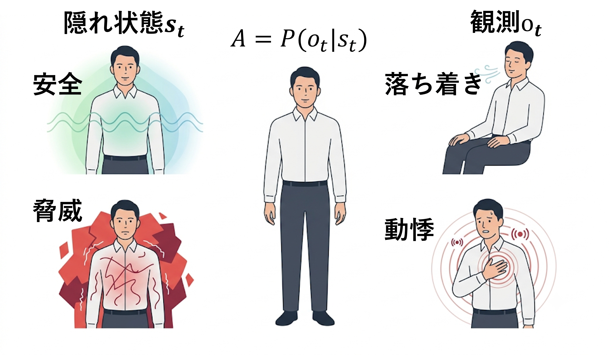
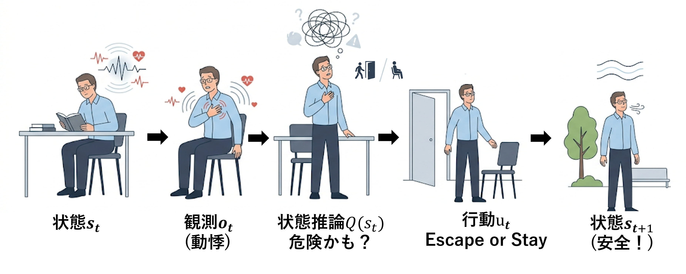
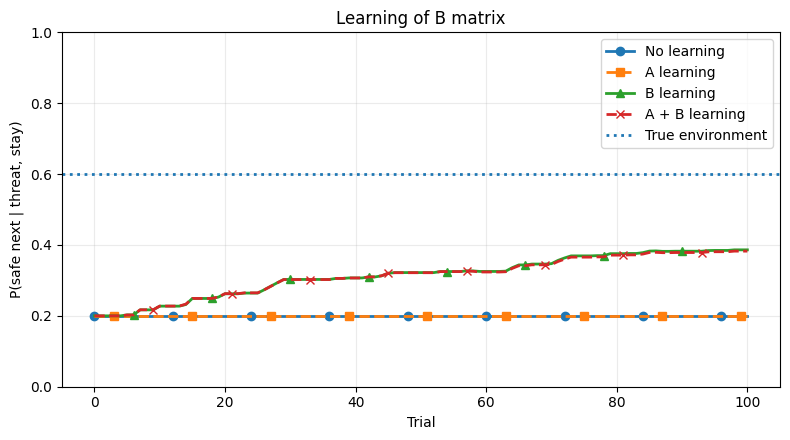
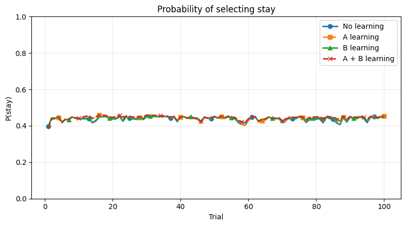
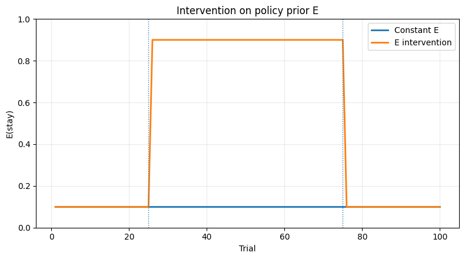
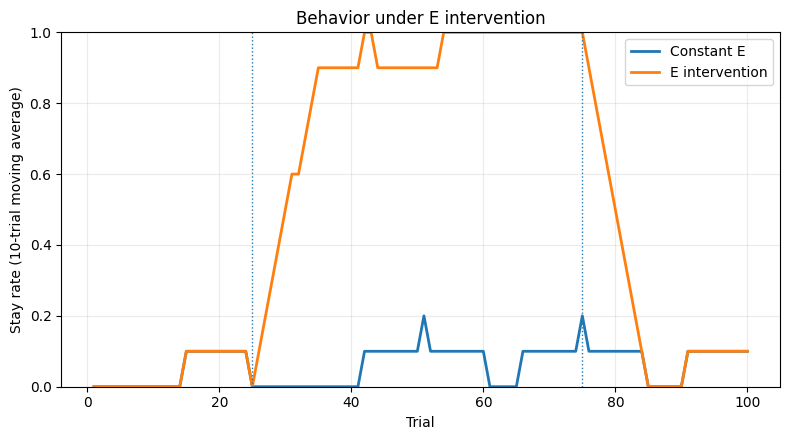
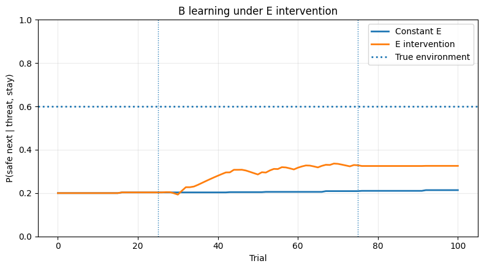
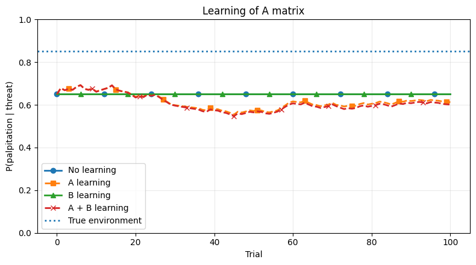

# 自己紹介

::: columns
::: {.column width="60%"}
-   **大水拓海(Takumi Omizu)**

-   専修大学大学院文学研究科心理学専攻博士後期課程(D1)

-   心理療法の作用機序や症状維持に関する計算論的アプローチ(心理ネットワーク，確率微分方程式，能動的推論)

-   本発表には生成AIを用いています(シミュレーションコードにGPT-5.6Sol，イラストにGeminiPro)。
:::

::: {.column width="40%"}

:::
:::

## 目的：心理療法による変化を生成モデルの「学習」として表現する

- $A$（状態→観測）と $B$（状態＋行動→次状態）は，経験によって学習できる。

- 本発表では，とくに **$B$：行動した後にどうなるかという予測の学習** に注目する。

- 方策事前分布 $E$ を操作し，新たな行動(`stay`)の経験機会を増やす。

**パニック症の回避と曝露を念頭に置いたトイモデルで検討する。**

::: {.notes}
- 生成モデルの学習にはAとBがある。
- 今回の中心はBで、「ある状態で、ある行動をした後にどうなると思っているか」という予測を扱う。
- さらにEを操作して、stayする経験を増やすことを介入の抽象化として扱う。
:::

## A行列：身体状態と身体感覚の対応

{fig-align="center"}

安全と推論している時に落ち着きを経験
：安全 → 落ち着きが強まる

::: {.notes}
- Aは「ある状態なら、どんな観測が生じるか」を表す。
- Aも経験から学習可能だが、今回はBを中心に話すため、ここでは直感的な意味だけ確認する。
:::

## B行列の学習：行動後にどうなるかを学ぶ

{fig-align="center"}

脅威→待機後に安全を経験するほど
**「待機しても安全になる」という予測が強まる**

::: {.notes}
- Bは「今の状態で、この行動をしたら次にどうなるか」を表す。
- 今回もっとも重要なのは threat + stay の後に safe へ移る予測。
- この予測が経験によって更新されるかを見る。
:::

## パニック症の回避と曝露：1試行の流れ

強い動悸の経験：**「身体は安全なのか／生命に関わる危機なのか」**

**Q. 回避せず待機する経験は「待機した後どうなるか」という予測Bをどう変えるか？**

::: {.notes}
- 動悸などの身体感覚から身体的危機を推論し、escape / stayを選択する。
- その行動結果を経験し、生成モデルを学習する。
- 中心的な問いは、stayする経験によってBがどう変わるか。
:::

## モデルのキーポイント：`stay` の結果を悲観的に予測している

$$
P(\mathrm{safe}_{t+1}\mid\mathrm{threat}_t,\mathrm{stay})
$$

:::::: {.columns}
::::: {.column width="48%"}
### エージェントの初期予測

$$
\mathbf{0.20}
$$

**「脅威状態で留まっても，安全には戻りにくい」**
:::::

::::: {.column width="48%"}
### 真の環境

$$
\mathbf{0.60}
$$

実際には，`stay` した後に安全へ移ることがある。
:::::
::::::

**このずれが，経験によって修正されるかを見る。**

::: {.notes}
- エージェントの初期信念と真の環境が異なることを示す。
- 特に重要なのがB：エージェントは threat + stay → safe を0.20、環境では0.60。
- つまり、「留まっても安全にならない」と過大に予測している。
:::

## Simulation 1｜まず，Bは経験だけで学習されるか？

- 100試行，介入なし
- 行動は通常の方策推論から確率的に選択

| 条件 | A learning | B learning |
|---|:---:|:---:|
| No learning | × | × |
| A learning | ○ | × |
| B learning | × | ○ |
| A + B learning | ○ | ○ |

**Bが学習されると，`stay` の選択も変わるか？**

::: {.notes}
- 元の4条件を比較するが、ここではBの学習と行動変化に注目する。
- A learningの詳細な結果は補足へ回す。
:::

## Simulation 1｜Bは学習するが行動は変わらない

:::::: {.columns}
::::: {.column width="49%"}

{width="100%"}

**B learning**

$P(\mathrm{safe}_{t+1}\mid\mathrm{threat}_t,\mathrm{stay})$

**0.20 → 約0.38**
:::::

::::: {.column width="49%"}

{width="100%"}

**Stayの選択**

mean $P(\mathrm{stay})$ は **0.438–0.445** とほぼ同じ
:::::
::::::

**予測は修正されるがモデルの学習だけでは直ちに行動は変わらない。**

::: {.notes}
- Bは0.20から環境の0.60方向へ更新される。
- しかし、stayの選択確率は4条件でほぼ同じ。
- つまり「信念が変わること」と「行動が変わること」は同じではない。
- ここから、「ならばstayする経験そのものを増やしたら？」というSimulation 2へ進む。
:::

## Simulation 2｜`stay` する経験そのものを増やす

$A/B$ を直接変更せず，一定期間だけ**`stay` 方策の選びやすさ**を高める。

{width="78%" fig-align="center"}

**回避せず留まる経験を得やすくする操作の抽象化**

::: {.notes}
- ここでは生成モデルA/Bを直接書き換えない。
- 方策事前分布Eだけを操作して、stayする経験機会を増やす。
- 介入が「何を経験するか」を変えるという位置づけ。
:::

## Simulation 2｜介入によって `stay` の経験が増える

{width="82%" fig-align="center"}

**介入中は `stay` が増え，介入終了後は再び減少する。**

**介入はBを直接書き換えず，学習に使える経験の分布を変える。**

::: {.notes}
- Eを介した方策選択の変化によりstayの実現率が大きく上昇。
- Eをbaselineへ戻すとstayは再び減少する。
- 重要なのは、Bを直接操作したわけではないこと。
:::

## Simulation 2｜増えた経験がB学習へ波及する {.figure-slide .scrollable}

{fig-align="center"}

Constant $E$はほぼ **0.20** のまま，$E$ interventionは環境方向にシフト
 
介入終了後も，学習したBは保持される。

**新しい経験を得る機会を作ることで，誤った遷移予測が修正される**

→認知を変えるにはまず行動から？

::: {.notes}
- stayする経験が増えると、threat + stay → safe の予測が更新される。
- 介入終了後にEを戻しても、学習されたBは残る。
- Eによる一時的な行動操作と、Bに残る学習を分けて見ることがポイント。
:::

## まとめ

- **Bは「行動した後にどうなるか」という予測**であり，経験によって学習される。

- Bが学習されても，**それだけで行動が大きく変わるとは限らない**。

- $E$ を介して `stay` の経験機会を増やすことで，**経験 → B学習**という介入過程を表現できる。

**能動的推論の枠組みを用いることで，心理療法を「経験を変え，その経験から生成モデルが学習する過程」として検討できる。**

## 補足｜モデル全体の設定 {.compact .scrollable}

:::::: {.columns}
::::: {.column width="49%"}
### エージェントの初期信念

$$
A_0=
\begin{pmatrix}
0.65&0.35\\
0.35&0.65
\end{pmatrix}
$$

`stay` の $B_0$：

$$
B_0^{\mathrm{stay}}=
\begin{pmatrix}
0.70&0.20\\
0.30&0.80
\end{pmatrix}
$$
:::::

::::: {.column width="49%"}
### 真の環境

$$
A^{Env}=
\begin{pmatrix}
0.85&0.15\\
0.15&0.85
\end{pmatrix}
$$

`stay` の $B^{Env}$：

$$
B_{Env}^{\mathrm{stay}}=
\begin{pmatrix}
0.75&0.60\\
0.25&0.40
\end{pmatrix}
$$
:::::
::::::

| 量 | 意味 | トイモデルでの扱い |
|---|---|---|
| $C=[1.5,-1.5]$ | calm / palpitation への選好 | 固定 |
| $D=[0.20,0.80]$ | 初期状態事前分布 | 固定 |
| $E=P(\pi)$ | 方策の事前分布 | Simulation 2 で操作 |
| $\gamma=1.0$ | 方策評価の精度 | 固定 |

初期総集中度：$\kappa_A=\kappa_B=5$  
学習率：$\eta_A=\eta_B=0.5$

## 補足｜Simulation 1：Aの学習 {.figure-slide .scrollable}

{width="78%" fig-align="center"}

A learningを許した条件ではAが更新されるが，真の環境0.85へ単調に収束するわけではない。

::: {.notes}
- Aの学習は、推論したQ(s_t)や経験分布に依存する。
- 本編ではB学習を中心に扱うため、Aの結果は補足に移した。
:::

## 補足｜生成モデルの学習とDirichletパラメータ {.scrollable}

- 尤度行列 $A$ や遷移行列 $B$ は固定値としておくこともできるが，エージェントにとって正しい値とは限らない。

- $P(o\mid s)$ や $P(s_{t+1}\mid s_t,u_t)$ 自体も，不確実性のある確率変数として扱う。

- $A$ や $B$ の各列をDirichlet分布のパラメータとして持ち，経験に応じて更新する。

$$
\text{経験}
\rightarrow
\text{Dirichletパラメータの更新}
\rightarrow
\text{生成モデル }A,B\text{ の変化}
$$

数式を丁寧に書いたDirichlet分布の説明と学習の計算過程は，必要に応じて補足する。
